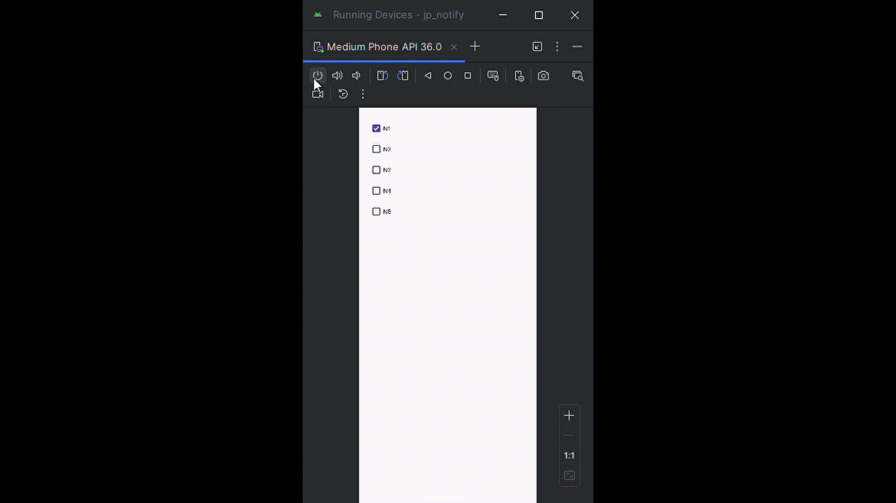

# JP Notify

**JP Notify** is an Android app that helps you memorize JLPT kanji passively. Every time you turn off your phone screen, the app shows a flashcard-style notification with a random kanji and its meaning.



---

## Features

- Flashcard-style kanji notifications shown when you turn off the screen  
- JLPT levels N1–N5 selectable from the app's interface  
- Works entirely offline using a bundled SQLite database  
- Lightweight and minimal UI  
- Fully customizable notification layout

---

## Installation

1. Clone this repository:

   ```bash
   git clone https://github.com/yourusername/jp-notify.git
   ```

2. Open the project in Android Studio.  
3. Build and run the app on your device (Android 6.0 or newer).

---

## How It Works

- The app uses a `BroadcastReceiver` that listens for the `SCREEN_OFF` event.  
- When the screen is turned off, it randomly selects a kanji from a local SQLite database.  
- A notification is shown with the kanji (and reading) as well as the meaning.  
- The user can configure which JLPT levels (N1 to N5) are included.

---

## Permissions

Android 13 and above require runtime permission for notifications:

```xml
<uses-permission android:name="android.permission.POST_NOTIFICATIONS" />
```

---

## Demo


---

